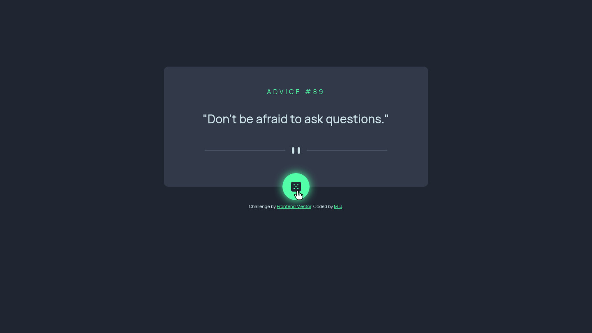
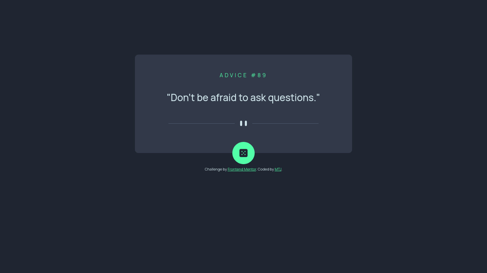
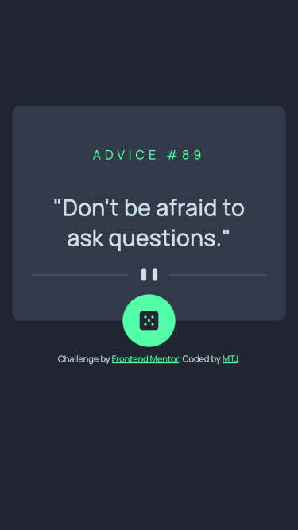

# Frontend Mentor - Advice generator app solution

This is a solution to the [Advice generator app challenge on Frontend Mentor](https://www.frontendmentor.io/challenges/advice-generator-app-QdUG-13db). Frontend Mentor challenges help you improve your coding skills by building realistic projects.

## Overview

### The challenge

Users should be able to:

- View the optimal layout for the app depending on their device's screen size
- See hover states for all interactive elements on the page
- Generate a new piece of advice by clicking the dice icon

### Screenshot

#### Frontend Mentor Design

#### My Design

### Links

- Solution URL: (https://github.com/mtjeth/Frontend-Mentor-Challenges-Solutions/tree/main/advice-generator-app)
- Live Site URL: (https://mtjeth.github.io/Frontend-Mentor-Challenges-Solutions/advice-generator-app/index.html)

## My process

### Built with

- Semantic HTML5 markup
- CSS custom properties
- Flexbox 
 
## Author

- Website - [MTJ](https://www.mtjeth.com)
- Frontend Mentor - [@mtjeth](https://www.frontendmentor.io/profile/mtjeth)
