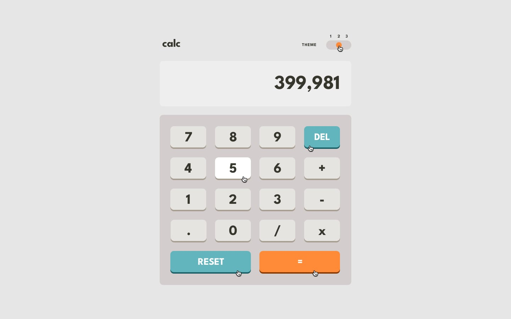

# Frontend Mentor - Calculator app solution

This is a solution to the [Calculator app challenge on Frontend Mentor](https://www.frontendmentor.io/challenges/calculator-app-9lteq5N29). Frontend Mentor challenges help you improve your coding skills by building realistic projects. 

 
### The challenge

Users should be able to:

- See the size of the elements adjust based on their device's screen size
- Perform mathmatical operations like addition, subtraction, multiplication, and division
- Adjust the color theme based on their preference
- **Bonus**: Have their initial theme preference checked using `prefers-color-scheme` and have any additional changes saved in the browser

### Extra features added by self
- filter and accept keyboard input
- backspace for del
- enter key could be use for equal
- store session prefrence theme for future use

### Screenshot 

#### Theme-1

-  Frontend-Mentor Design
  
  
  

-  My Design
  
  
  

#### Theme-2

-  Frontend-Mentor Design
  
  
  

-  My Design
  
  
  

#### Theme-3

-  Frontend-Mentor Design
  
  
  

-  My Design
  
  
  

### Links

- Solution URL: (https://github.com/mtjeth/Frontend-Mentor-Challenges-Solutions/tree/main/calculator-app)
- Live Site URL: (https://mtjeth.github.io/Frontend-Mentor-Challenges-Solutions/calculator-app/index.html)

## My process

-started out by figuring javascript part then implmenting css based on it.

### Built with

- Semantic HTML5 markup
- CSS custom properties
- Flexbox
- CSS Grid
- Mobile-first workflow

### Continued development

- javascript and css relationship

## Author

- Website - [MTJ](https://www.mtjeth.com)
- Frontend Mentor - [@mtjeth](https://www.frontendmentor.io/profile/mtjeth)
