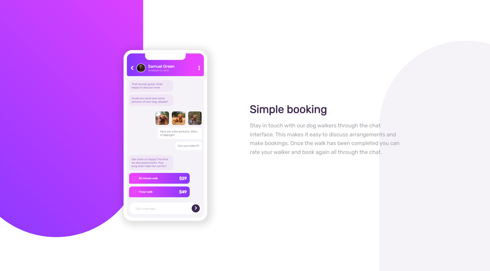
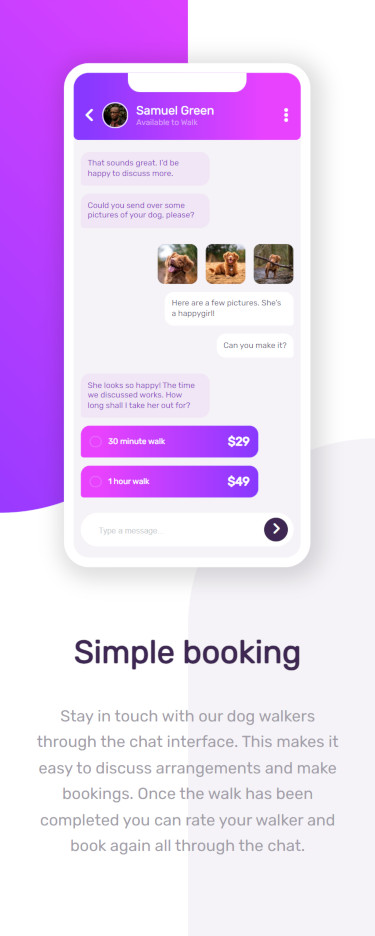

# Frontend Mentor - Chat app CSS illustration solution

This is a solution to the [Chat app CSS illustration challenge on Frontend Mentor](https://www.frontendmentor.io/challenges/chat-app-css-illustration-O5auMkFqY). Frontend Mentor challenges help you improve your coding skills by building realistic projects. 

## Overview

### The challenge

Users should be able to:

- View the optimal layout for the component depending on their device's screen size 

### Screenshot

Frontend-Mentor Design

My Design

### Links

- Solution URL: (https://github.com/mtjeth/Frontend-Mentor-Challenges-Solutions/tree/main/chat-app-css-illustration)
- Live Site URL: (https://mtjeth.github.io/Frontend-Mentor-Challenges-Solutions/chat-app-css-illustration/index.html)

## My process

### Built with

- Semantic HTML5 markup
- CSS custom properties
- Flexbox
- CSS Grid
- Mobile-first workflow

### What I learned

- Learned how to work with gradients.
- learned using div to make simple background.

## Author

- Website - [MTJ](https://www.mtjeth.com)
- Frontend Mentor - [@mtjeth](https://www.frontendmentor.io/profile/mtjeth)
