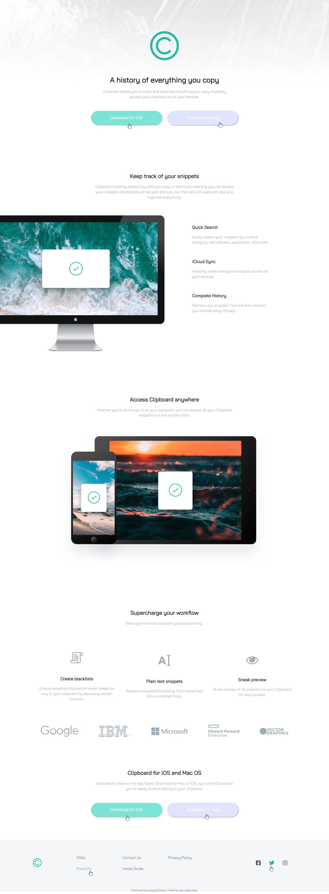
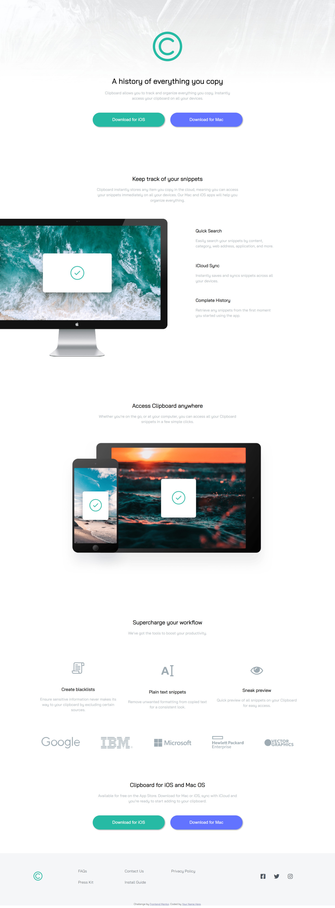
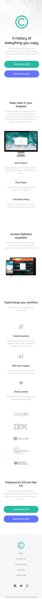

# Frontend Mentor - Clipboard landing page solution

This is a solution to the [Clipboard landing page challenge on Frontend Mentor](https://www.frontendmentor.io/challenges/clipboard-landing-page-5cc9bccd6c4c91111378ecb9). Frontend Mentor challenges help you improve your coding skills by building realistic projects. 

## Overview

### The challenge

Users should be able to:

- View the optimal layout for the site depending on their device's screen size
- See hover states for all interactive elements on the page

### Screenshot

Frontend-Mentor Design

My Design

### Links

- Solution URL: (https://github.com/mtjeth/Frontend-Mentor-Challenges-Solutions/tree/main/clipboard-landing-page)
- Live Site URL: (https://mtjeth.github.io/Frontend-Mentor-Challenges-Solutions/clipboard-landing-page/index.html)

### Built with

- Semantic HTML5 markup
- CSS custom properties
- Flexbox
- CSS Grid
- Mobile-first workflow

## My process

By breaking down every component one by one and using suitable grids then styles to make it as close as possible to the orginal one.

## Author

- Website - [MTJ](https://www.mtjeth.com)
- Frontend Mentor - [@mtjeth](https://www.frontendmentor.io/profile/mtjeth)
