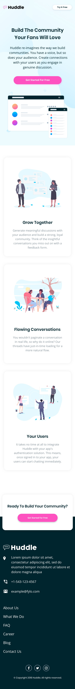
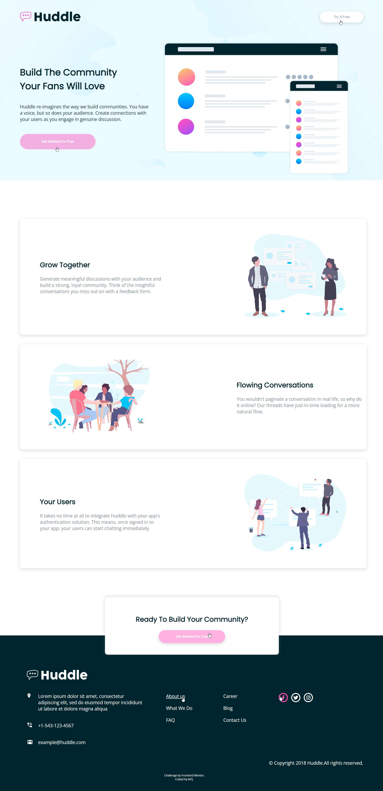
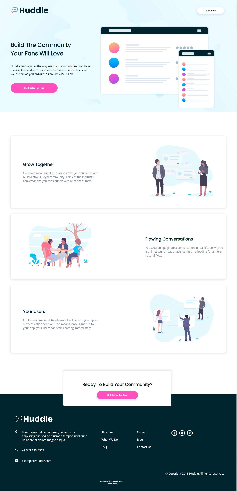

# Frontend Mentor - Huddle landing page with alternating feature blocks solution

This is a solution to the [Huddle landing page with alternating feature blocks challenge on Frontend Mentor](https://www.frontendmentor.io/challenges/huddle-landing-page-with-alternating-feature-blocks-5ca5f5981e82137ec91a5100). Frontend Mentor challenges help you improve your coding skills by building realistic projects. 
## Overview

### The challenge

Users should be able to:

- View the optimal layout for the site depending on their device's screen size
- See hover states for all interactive elements on the page

### Screenshot

Frontend-Mentor Design

My Design

### Links

- Solution URL: (https://github.com/mtjeth/Frontend-Mentor-Challenges-Solutions/tree/main/huddle-landing-page-with-alternating-feature-blocks)
- Live Site URL: (https://mtjeth.github.io/Frontend-Mentor-Challenges-Solutions/huddle-landing-page-with-alternating-feature-blocks%20/index.html)

## My process

By breaking down every component one by one and using suitable grids then styles to make it as close as possible to the orginal one.

### Built with

- Semantic HTML5 markup
- CSS custom properties
- Sass

## Author

- Website - [MTJ](https://www.mtjeth.com)
- Frontend Mentor - [@mtjeth](https://www.frontendmentor.io/profile/mtjeth)

### What I learned

I have learned how to manipulate contents using position property and using z-index property to overlay contents on eachother.