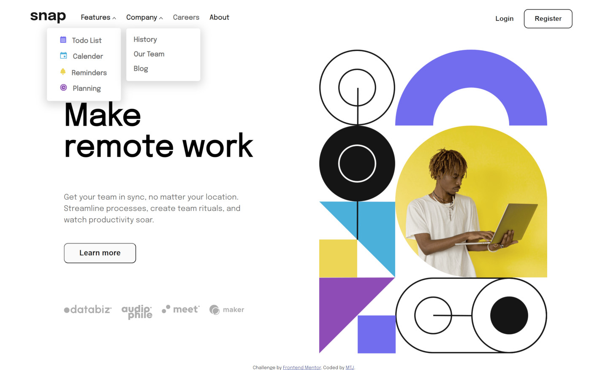
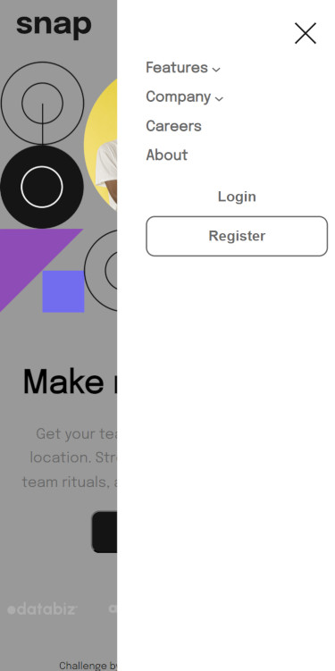
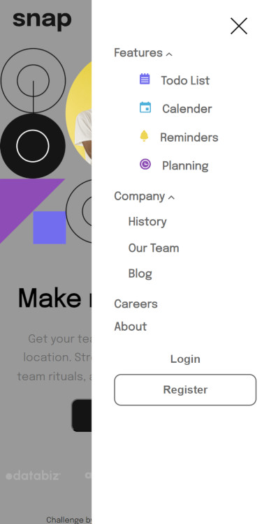

# Frontend Mentor - Intro section with dropdown navigation solution

This is a solution to the [Intro section with dropdown navigation challenge on Frontend Mentor](https://www.frontendmentor.io/challenges/intro-section-with-dropdown-navigation-ryaPetHE5). Frontend Mentor challenges help you improve your coding skills by building realistic projects. 

## Overview

### The challenge

Users should be able to:

- View the relevant dropdown menus on desktop and mobile when interacting with the navigation links
- View the optimal layout for the content depending on their device's screen size
- See hover states for all interactive elements on the page

### Screenshot

Frontend-Mentor Design

My Design

### Links

- Solution URL: (https://github.com/mtjeth/Frontend-Mentor-Challenges-Solutions/tree/main/intro-section-with-dropdown-navigation-main)
- Live Site URL: (https://mtjeth.github.io/Frontend-Mentor-Challenges-Solutions/intro-section-with-dropdown-navigation-main/index.html)

## My process
I started from top to bottom approach then thr menu with diffrent configration for mobile and desktop.

### Built with

- Semantic HTML5 markup
- CSS custom properties
- Flexbox
- CSS Grid
- sass 

### What I learned

I learned ways to manipulate side bar and menu bars.

**Note: Delete this note and the content within this section and replace with your own learnings.**

### Continued development

javascript and css relationship

### Useful resources

- [w3schools](https://www.w3schools.com/) - This helped me to make the sidebar.

## Author

- Website - [MTJ](https://www.mtjeth.com)
- Frontend Mentor - [@mtjeth](https://www.frontendmentor.io/profile/mtjeth)

