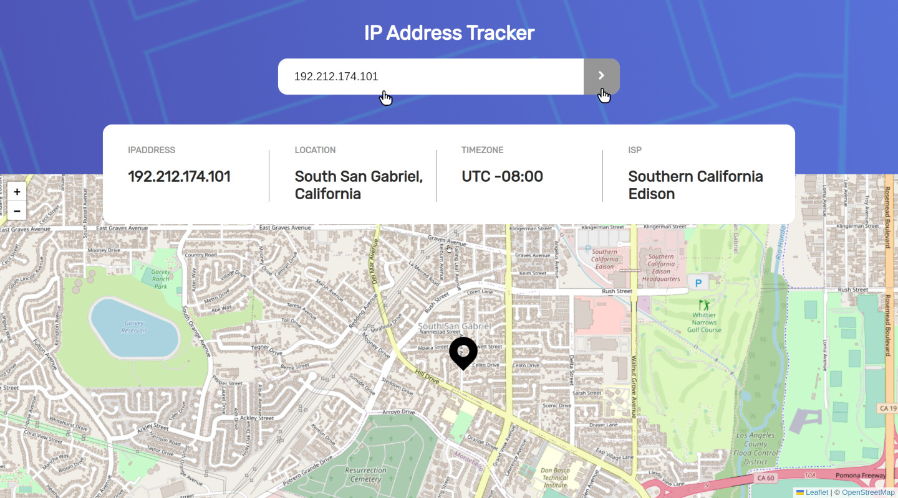
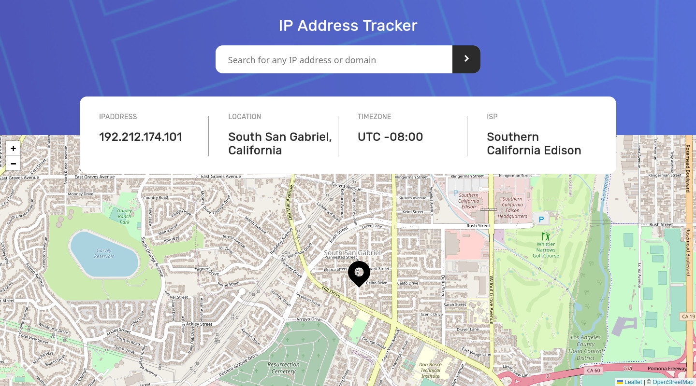
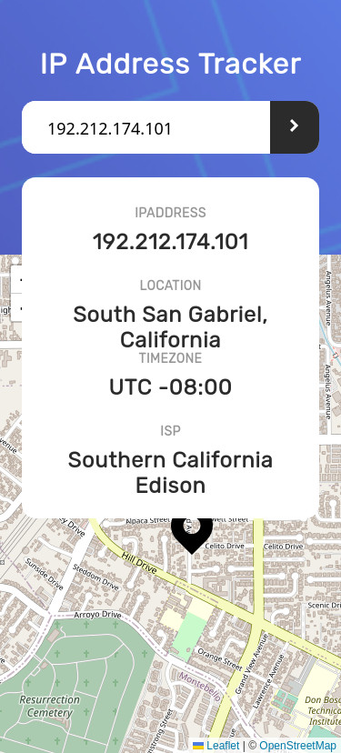

# Frontend Mentor - IP address tracker solution

This is a solution to the [IP address tracker challenge on Frontend Mentor](https://www.frontendmentor.io/challenges/ip-address-tracker-I8-0yYAH0). Frontend Mentor challenges help you improve your coding skills by building realistic projects. 

## Overview

### The challenge

Users should be able to:

- View the optimal layout for each page depending on their device's screen size
- See hover states for all interactive elements on the page
- See their own IP address on the map on the initial page load
- Search for any IP addresses or domains and see the key information and location

### Screenshot

#### Frontend-Mentor Design
  
  
  
   

#### My Design
  
  
  

### Links

- Solution URL: (https://github.com/mtjeth/Frontend-Mentor-Challenges-Solutions/tree/main/ip-address-tracker)
- Live Site URL: (https://mtjeth.github.io/Frontend-Mentor-Challenges-Solutions/ip-address-tracker/index.html)

## My process

### Built with

- Semantic HTML5 markup
- CSS custom properties
- Flexbox
- CSS GridFor  
- IP Geolocation API [IPify](https://geo.ipify.org/)
- To generate the map [LeafletJS](https://leafletjs.com/) 

### What I learned

 - How to use IPify api.
 - How to use LeafletJS.
 
## Author

- Website - [MTJ](https://www.mtjeth.com)
- Frontend Mentor - [@mtjeth](https://www.frontendmentor.io/profile/mtjeth)
 