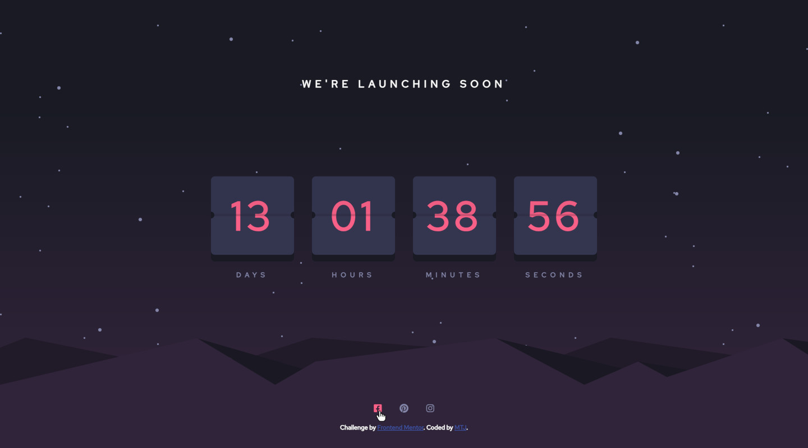
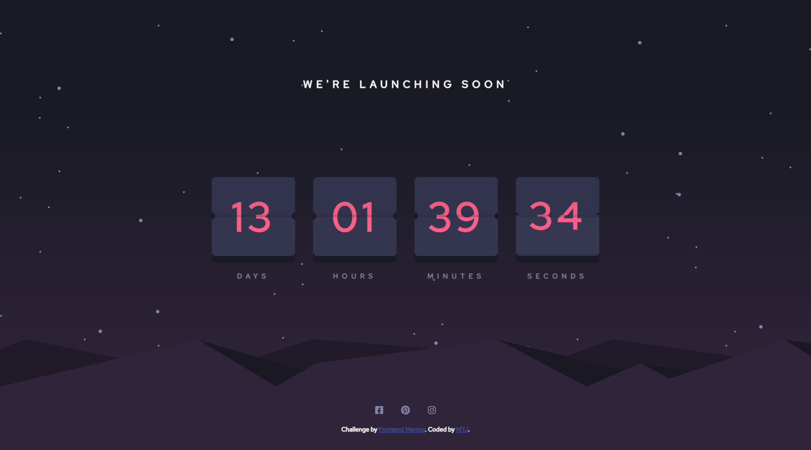
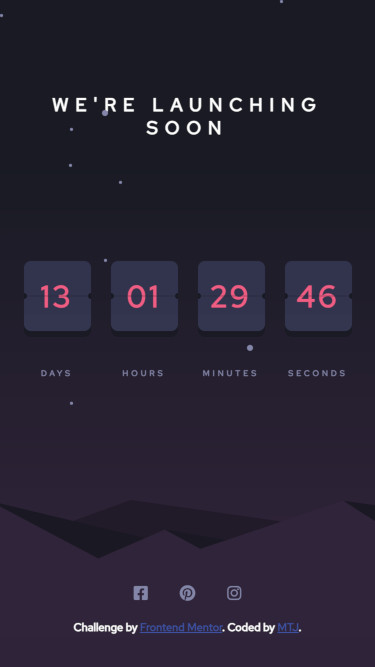

# Frontend Mentor - Launch countdown timer solution

This is a solution to the [Launch countdown timer challenge on Frontend Mentor](https://www.frontendmentor.io/challenges/launch-countdown-timer-N0XkGfyz-). Frontend Mentor challenges help you improve your coding skills by building realistic projects. 

## Overview

### The challenge

Users should be able to:

- See hover states for all interactive elements on the page
- See a live countdown timer that ticks down every second (start the count at 14 days and cycles every 14 days)
- **Bonus**: When a number changes, make the card flip from the middle

### Screenshot

Frontend-Mentor Design

 

My Design

 

### Links

- Solution URL: (https://github.com/mtjeth/Frontend-Mentor-Challenges-Solutions/tree/main/launch-countdown-timer)
- Live Site URL: (https://mtjeth.github.io/Frontend-Mentor-Challenges-Solutions/launch-countdown-timer/index.html)

## My process

### Built with

- Semantic HTML5 markup
- CSS custom properties
- Flexbox
- CSS Grid

### What I learned

 - This project was good to tackle and learn more about animation and other css properties as rotate.
 - Using JavaScript to track time and start animation.

## Author

- Website - [MTJ](https://www.mtjeth.com)
- Frontend Mentor - [@mtjeth](https://www.frontendmentor.io/profile/mtjeth)
 