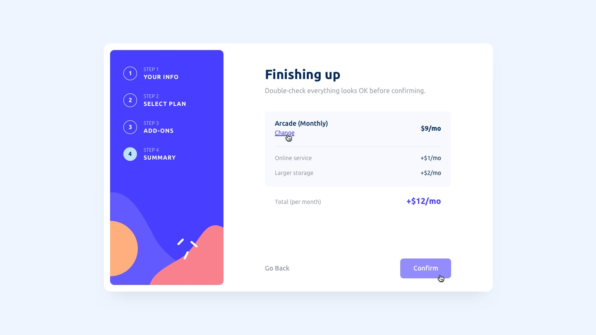
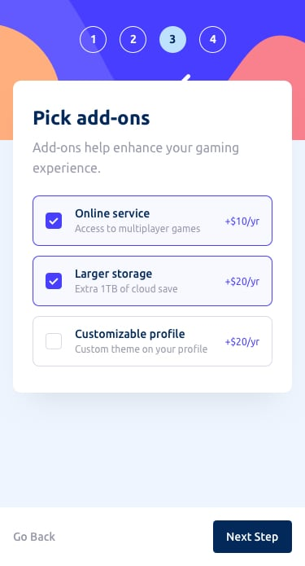
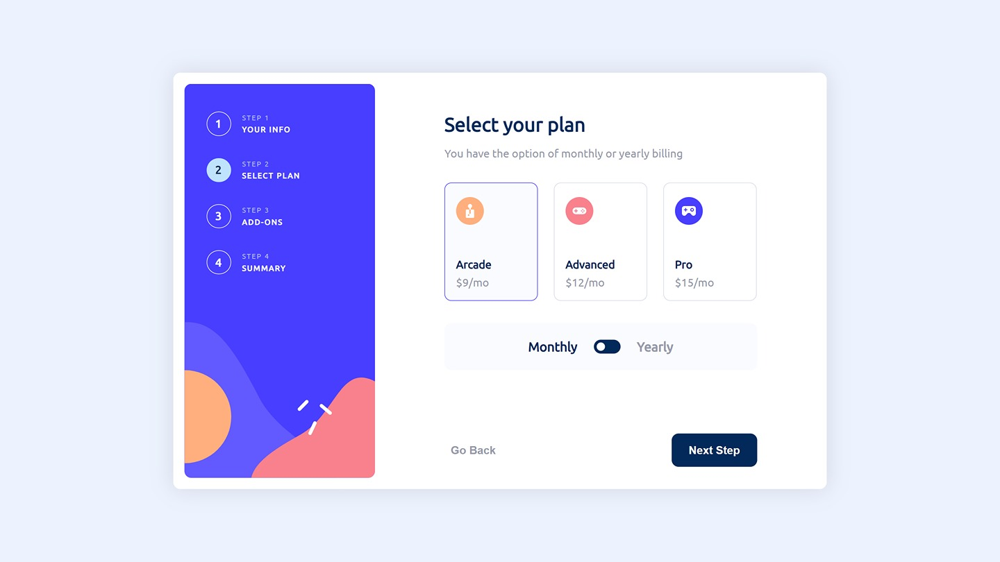
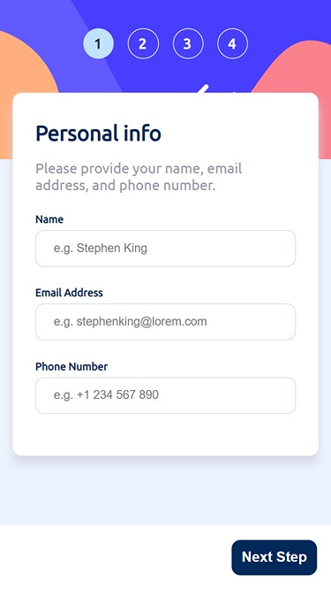
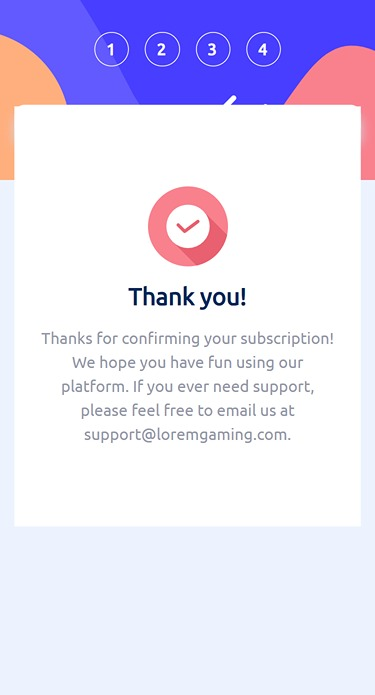

# Frontend Mentor - Multi-step form solution

This is a solution to the [Multi-step form challenge on Frontend Mentor](https://www.frontendmentor.io/challenges/multistep-form-YVAnSdqQBJ). Frontend Mentor challenges help you improve your coding skills by building realistic projects. 

## Table of contents

- [Overview](#overview)
  - [The challenge](#the-challenge)
  - [Screenshot](#screenshot)
    - [Frontend Mentor Design](#Frontend-Mentor-Design)
    - [My Design](#my-design)
  - [Links](#links)
- [My process](#my-process)
  - [Built with](#built-with) 
- [Author](#author) 

## Overview

### The challenge

Users should be able to:

- Complete each step of the sequence
- Go back to a previous step to update their selections
- See a summary of their selections on the final step and confirm their order
- View the optimal layout for the interface depending on their device's screen size
- See hover and focus states for all interactive elements on the page
- Receive form validation messages if:
  - A field has been missed
  - The name has less than 3 letters
  - The email address is not formatted correctly
  - The phone number is not numbers
  - A step is submitted, but no selection has been made

### Screenshot

#### Frontend-Mentor Design

#### My Design

### Links

- Solution URL: (https://github.com/mtjeth/Frontend-Mentor-Challenges-Solutions/tree/main/multi-step-form)
- Live Site URL: (https://mtjeth.github.io/Frontend-Mentor-Challenges-Solutions/multi-step-form/index.html)

## My process

### Built with

- Semantic HTML5 markup
- CSS custom properties
- Flexbox
- Sass
- Vanilla JS
 
## Author

- Website - [MTJ](https://www.mtjeth.com)
- Frontend Mentor - [@mtjeth](https://www.frontendmentor.io/profile/mtjeth)