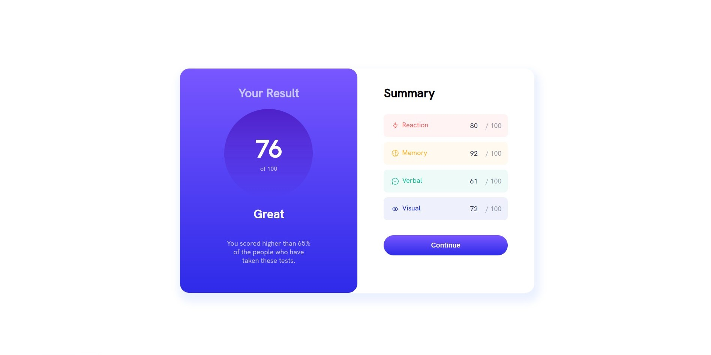
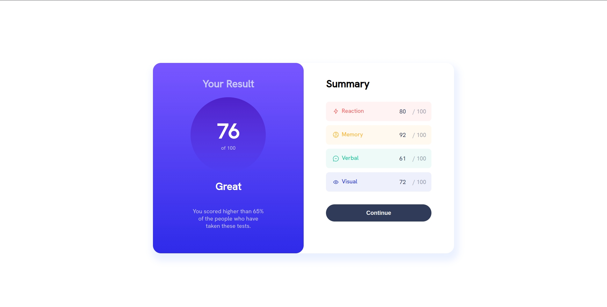
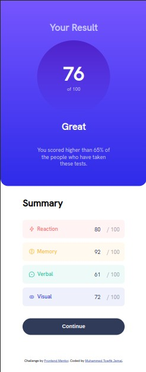

# Frontend Mentor - Results summary component solution

This is a solution to the [Results summary component challenge on Frontend Mentor](https://www.frontendmentor.io/challenges/results-summary-component-CE_K6s0maV). Frontend Mentor challenges help you improve your coding skills by building realistic projects. 

## Overview

### The challenge

Users should be able to:

- View the optimal layout for the interface depending on their device's screen size
- See hover and focus states for all interactive elements on the page

### Screenshot

Frontend-Mentor Design

My Design

### Links

- Solution URL: (https://github.com/mtjeth/Frontend-Mentor-Challenges-Solutions/results-summary)
- Live Site URL: (https://mtjeth.github.io/Frontend-Mentor-Challenges-Solutions/results-summary/index.html)

## My process
By breaking down every component one by one and using suitable grids then styles to make it as close as possible to the orginal one.

### Built with

- Semantic HTML5 markup
- CSS custom properties
- Sass

## Author

- Website - [MTJ](https://www.mtjeth.com)
- Frontend Mentor - [@mtjeth](https://www.frontendmentor.io/profile/mtjeth)