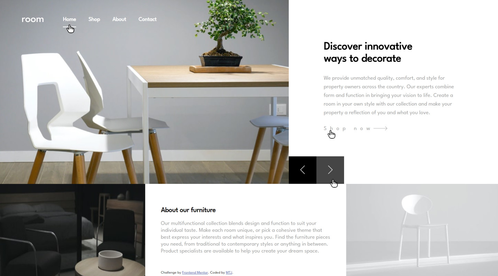
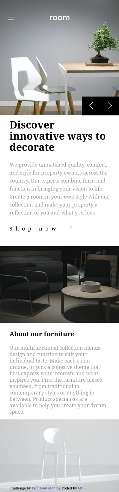
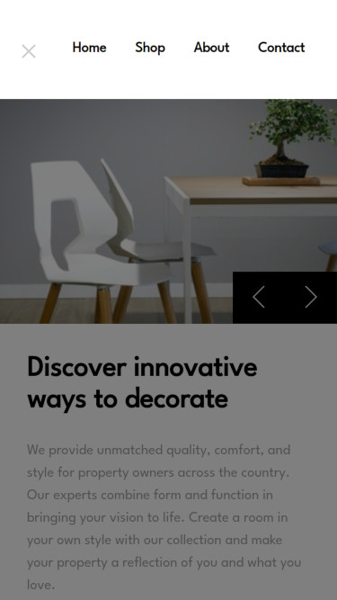

# Frontend Mentor - Room homepage solution

This is a solution to the [Room homepage challenge on Frontend Mentor](https://www.frontendmentor.io/challenges/room-homepage-BtdBY_ENq). Frontend Mentor challenges help you improve your coding skills by building realistic projects. 

## Overview

### The challenge

Users should be able to:

- View the optimal layout for the site depending on their device's screen size
- See hover states for all interactive elements on the page
- Navigate the slider using either their mouse/trackpad or keyboard

### Screenshot

#### Frontend-Mentor Design 

- 
- 
- 
- 
- 
- 

#### My Design 

- 
- 
- 
- 
- 
- 

### Links

- Solution URL: (https://github.com/mtjeth/Frontend-Mentor-Challenges-Solutions/tree/main/room-homepage)
- Live Site URL: (https://mtjeth.github.io/Frontend-Mentor-Challenges-Solutions/room-homepage/index.html)
 
### Built with

- Semantic HTML5 markup
- CSS custom properties 

## Author

- Website - [MTJ](https://www.mtjeth.com)
- Frontend Mentor - [@mtjeth](https://www.frontendmentor.io/profile/mtjeth)
