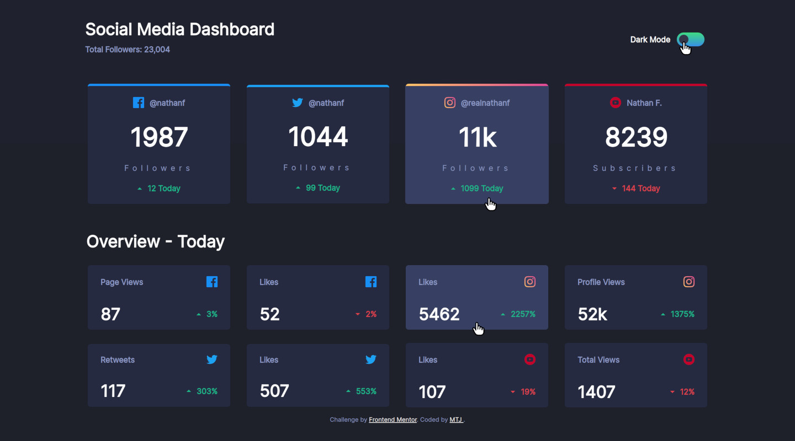
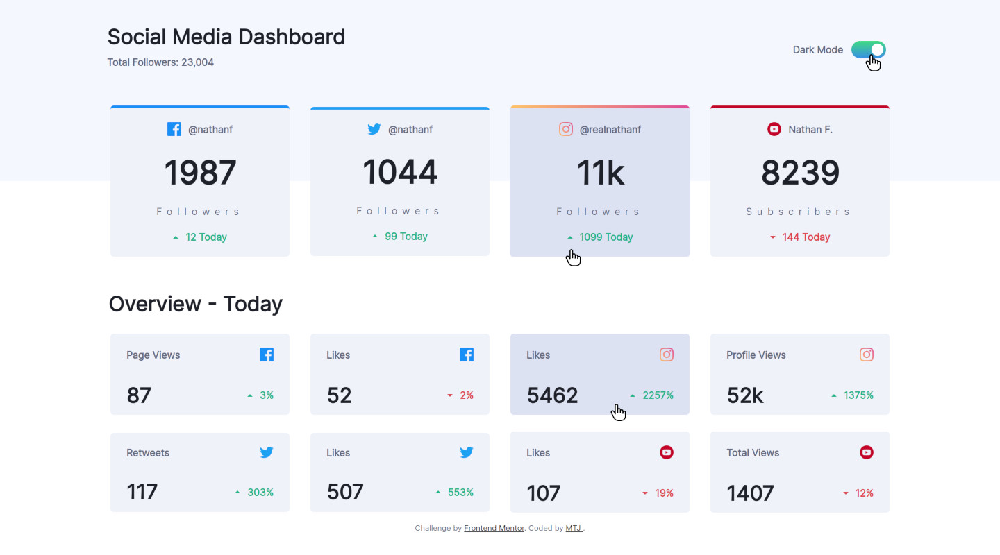
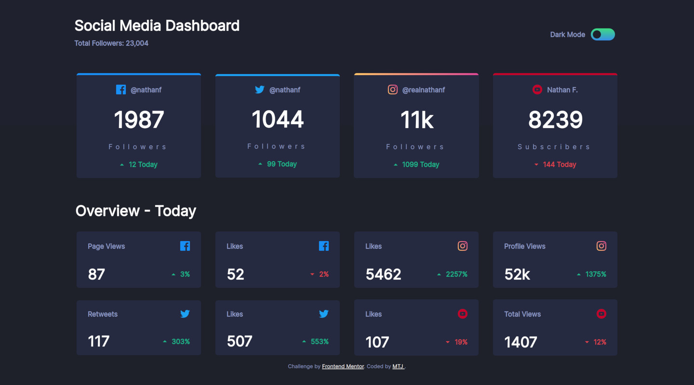
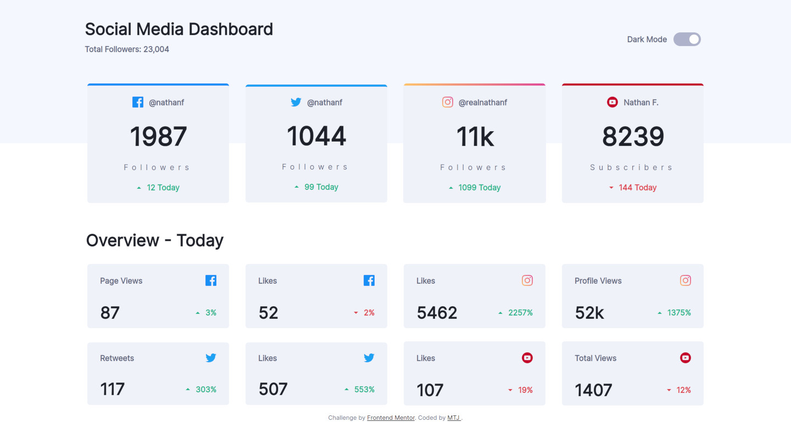
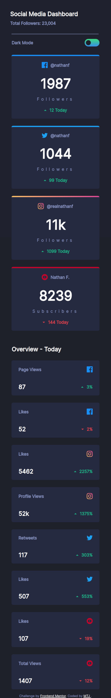
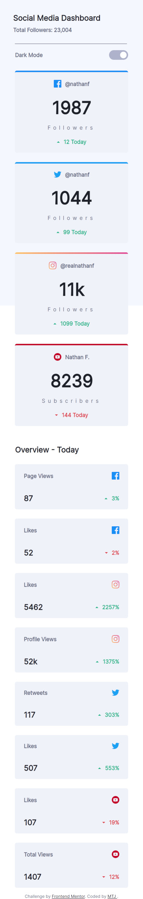

# Frontend Mentor - Social media dashboard with theme switcher solution

This is a solution to the [Social media dashboard with theme switcher challenge on Frontend Mentor](https://www.frontendmentor.io/challenges/social-media-dashboard-with-theme-switcher-6oY8ozp_H). Frontend Mentor challenges help you improve your coding skills by building realistic projects. 

## Overview

### The challenge

Users should be able to:

- View the optimal layout for the site depending on their device's screen size
- See hover states for all interactive elements on the page
- Toggle color theme to their preference

### Screenshot

#### Frontend-Mentor Design
  
  
  
  
  
  
   

#### My Design
  
  
  
  
  
  
 
### Links

- Solution URL: (https://github.com/mtjeth/Frontend-Mentor-Challenges-Solutions/tree/main/social-media-dashboard-with-theme-switcher)
- Live Site URL: (https://mtjeth.github.io/Frontend-Mentor-Challenges-Solutions/social-media-dashboard-with-theme-switcher/index.html)

## My process

### Built with

- Semantic HTML5 markup
- CSS custom properties
- CSS Grid  
 
## Author

- Website - [MTJ](https://www.mtjeth.com)
- Frontend Mentor - [@mtjeth](https://www.frontendmentor.io/profile/mtjeth)
 