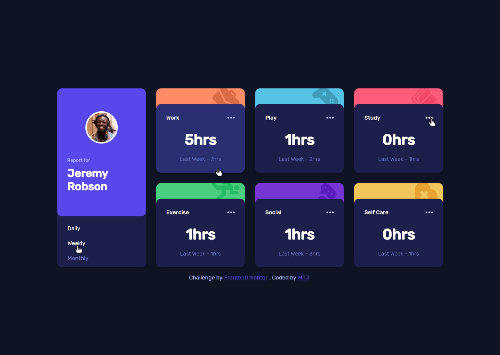
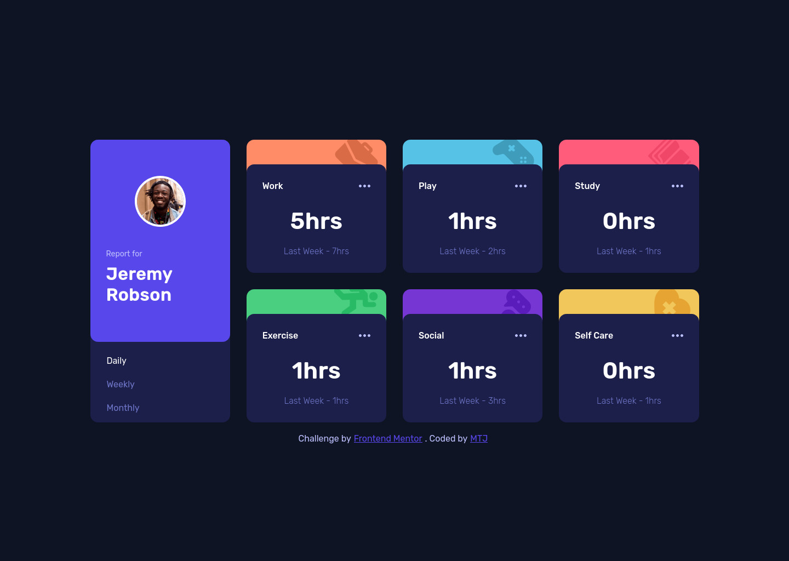
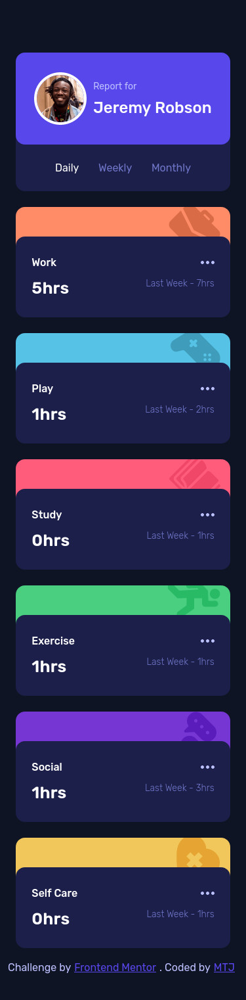

# Frontend Mentor - Time tracking dashboard solution

This is a solution to the [Time tracking dashboard challenge on Frontend Mentor](https://www.frontendmentor.io/challenges/time-tracking-dashboard-UIQ7167Jw). Frontend Mentor challenges help you improve your coding skills by building realistic projects. 

## Overview

### The challenge

Users should be able to:

- View the optimal layout for the site depending on their device's screen size
- See hover states for all interactive elements on the page
- Switch between viewing Daily, Weekly, and Monthly stats

### Screenshot

#### My Design

- 
-  
-  
- 

#### Frontend Mentor Design

- 
-  
-  
- 

### Links

- Solution URL: (https://github.com/mtjeth/Frontend-Mentor-Challenges-Solutions/tree/main/time-tracking-dashboard)
- Live Site URL: (https://mtjeth.github.io/Frontend-Mentor-Challenges-Solutions/time-tracking-dashboard/)

## My process

### Built with

- Semantic HTML5 markup 
- Flexbox
- CSS Grid
- Mobile-first workflow
- [React](https://reactjs.org/) - JS library 
- [Styled System](https://github.com/styled-system/styled-system) - For styles
- [Emotion](https://emotion.sh/) - React library
- [vite](https://vitejs.dev/) -Build Tool

## Author

- Website - [MTJ](https://www.mtjeth.com)
- Frontend Mentor - [@mtjeth](https://www.frontendmentor.io/profile/mtjeth)
